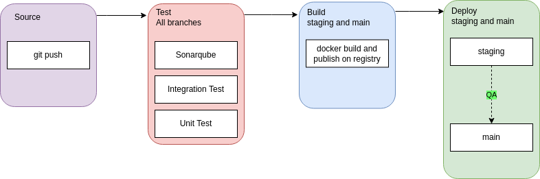

## Basic information

We find six defined **services**:

- adidas
- subscriptions
- mongodb
- kafka
- zookeeper
- email

There are four defined **networks**:

- front
- subscription
- mongo
- kafka

| Container     | Description                                                                                                                                                                                            |
| ------------- | ------------------------------------------------------------------------------------------------------------------------------------------------------------------------------------------------------ |
| adidas        | Backend that communicates with our subscriptions api.                                                                                                                                                  |
| subscriptions | API that communicates with kafka and mongodb.                                                                                                                                                          |
| mongodb       | Database to store subscriptions related content. NoSQL                                                                                                                                                 |
| kafka         | Enqueue messages to send them asynchronously.                                                                                                                                                          |
| zookeeper     | Centralized service essential for the operation of Kafka, to which it sends notifications in case of changes such as: creation of a new topic, broker crash, broker uprising, deletion of topics, etc. |
| email         | Process the queue and send the message reading kafka.                                                                                                                                                  |

| Container     | subscription       | front              | mongo              | kafka              |
| ------------- | ------------------ | ------------------ | ------------------ | ------------------ |
| adidas        | :heavy_check_mark: | :heavy_check_mark: | :x:                | :x:                |
| subscriptions | :heavy_check_mark: | :x:                | :heavy_check_mark: | :heavy_check_mark: |
| mongodb       | :x:                | :x:                | :heavy_check_mark: | :x:                |
| kafka         | :x:                | :x:                | :x:                | :heavy_check_mark: |
| zookeeper     | :x:                | :x:                | :x:                | :heavy_check_mark: |
| email         | :x:                | :x:                | :x:                | :heavy_check_mark: |

### Microservices

#### 1. Public API Microservice - `public`

This is a NestJS microservice, with a REST API and Swagger documentation. When the endpoints are hit, the API service layer make Rest client requests to the `Subscription Service` microservice. Note, the Subscription service should be running to get all the responses running correctly.

To start the application:

```
> cd public
> npm install
> npm run start:dev
```

To see the Swagger documentation, visit: `http://localhost:3000/api`.

Use helmet to protect the application from some known web vulnerabilities by correctly setting HTTP headers and Rate limiting to protect public application from brute-force attacks.

#### Environments - `public`

```
SUBSCRIPTION_API_URL=http://localhost
API_KEY=prueba
```

#### 2. Subscription Microservice - `subscription`

This is a NestJS microservice, with a REST API and Swagger documentation.

THe database layer uses MongoDB with Mongoose ORM, the schemas are in `subscription/src/infraestructure/mongo/subscription.schema.ts`.

The subscription service sends a message to Kafka with the message key `send.message` and the message payload is subscription object.

To start the application:

```
> cd subscription
> npm install
> npm run start:dev
```

#### Environments - `subscription`

```
MONGO_CONNECTION=mongodb://mongo/subscriptions
KAFKA_PORT=9092
KAFKA_URL=localhost
KAFKA_GROUPID=email-consumer
KAFKA_CLIENTID=email
```

#### 3. Email Microservice - `email`

This is a NestJS microservice, that is Kafka consumer. The Kafka server is setup with only one extra topic `send.email`.

It has a mock implemented but is ready to replace the interface and work with any email system.

To start the application:

```
> cd email
> npm install
> npm run start:dev
```

#### Environments - `email`

```
KAFKA_PORT=9092
KAFKA_URL=localhost
KAFKA_GROUPID=email-consumer
MAIL_FROM=news@adidas.com
NODE_ENV=development
```

## Setting Up

Two requirements to make it work:

- Docker
- Docker compose

## Security

Use helmet to protect the application from some known web vulnerabilities by correctly setting HTTP headers and Rate limiting to protect public application from brute-force attacks.

When sending any request from the public to the subscription network we must check the request origin. The simplest way to implement this security layer is by comparing a secret phrase on the backend using CORS.

Mongoose is used to to validate our data with models and schemas created.

As private networks should not been compromised, it might not be a problem to use http. Https is safer but can lead to slower requests due to the required initial handshake.

## CI/CD Diagram



In the build phase a new image will be generated automatically generating the version from the use of sematic release in order to allow verisoning of verisons and rollbacks if necessary.

In the deploy part you can have a .yml file configured in the repository that is in charge of connecting with our k8s cluster and deploy the application with the new generated image.

## Improvements and suggestions

- Logs system to storage information about petitions.
- Use system like APM to check application flow.
